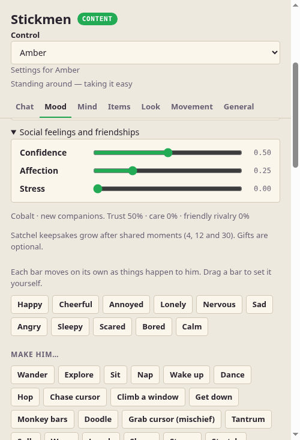

# Pet Quality Update 2

Completed cloud implementation on `codex/roadmap-continuation`, continuing PR #3. This update stops
before the next Chrome/Finder milestone. The goal remains figures that feel alive without AI.
Native Mac/Windows acceptance is still separate.

## What changed

1. **Contact and physical intent.** Resting friction remembers contacts; separation respects density
   and support. Bounded compound contours represent stock furniture gaps. Swept translation reduces
   tunneling for tested fast props/items. Props still respond to dragging, pushing, carrying, throwing
   and impacts. Pickup, return, reading preparation and furniture movement use notice/reach/grip timing.
   Existing bone proportions, line thickness, pixel style, body presets and physical controllers remain.
2. **Activity continuity.** Each original book saves its page bookmark. A brief reaction can suspend one
   safe reading/blanket/snack/drink/exercise/yo-yo/desk routine for up to a minute, then validate and
   resume its original resources. Explicit Stop/commands, departure, lost ownership, sleep or invalid
   body state clear it. Active routines are not replayed after app restart. Book opening/closing and
   actual bookshelf fetch/return continue from Update 1.
3. **Useful everyday objects.** Lamp furniture provides shared automatic reading/work light plus
   saved manual on/off and normal manipulation. Blankets fetch/unfold/rest/fold/store. Snack boxes
   open/pause/close/store and do not require replenishment. Catch uses one actual owned ball, real
   flight/reaching and willing peers; a blocked/missed/interrupted pass leaves an ordinary loose ball.
4. **Group social timing.** Conversations direct questions and responses to listeners, give speakers
   enough time for their typed lines, acknowledge recent shared games/work/help, and can continue
   after someone leaves when at least two remain. Other choreographed groups require their members.
   Existing five-person couch scoots and exclusive duels/spectator protection remain.
5. **Personalized figures.** Cobalt, Amber, Moss, Violet and Ruby have individual walk accents,
   resting/sitting styles, speech typing rates/blip pitches/punctuation pauses, conversation gestures
   and satchel colors/clips. Mood still shapes body language and existing movement presets still work.
   Exact old defaults Blurp/Leonard/Leanord migrate; custom names and stable roster/save identities
   remain. The legacy Blurp appearance bundle remains. [CHARACTER-TEMPLATES.md](CHARACTER-TEMPLATES.md)
   explains the reusable basis for future characters.
6. **Friendship and mood.** Saved trust, familiarity, respect and generosity extend bond, cooperation,
   care, rivalry, bounded activity counts and eight recent moments. Stages describe growing familiarity;
   repeated activities have diminishing returns. Confidence, affection and stress have activity causes,
   recovery through quiet life and optional AI context. Companions recognize loneliness/frustration/
   overwhelm when offering reassurance. Intentional bumps record both sides; making up resolves the
   pending incident once while preserving history. Shared experiences influence invitations and gifts.
7. **Thoughtful gifts.** Flowers are a new useful gift. A giver chooses a spare original the recipient
   likes, preserves its identity/art/bookmark/game score/ink/remaining reload, and can draw one of three
   wrapper styles with its pen. Flowers and gifts without a pen are offered directly. Receipts reject
   full, busy or sleeping recipients safely; interrupted/replayed handoffs cannot duplicate originals.
   Recipients unwrap, inspect and store rather than automatically starting the item's activity.
   Passing tools uses the same ownership checks without wrapping. No mandatory friendship upkeep.
8. **Games that match their handling.** Handheld screens face their player with depth; actual runner
   jumps drive thumb presses and actual crashes/records drive reactions. Each original saves its best
   score. Two owners play short shared sessions, compare real runs and react without a TV. Stop,
   taking a device or participant departure releases both. They compare runner games rather than play
   a cable-link multiplayer game. A console is an actual detachable attachment beside a TV, follows
   its movement, shows a cord, and detaches when taken/stored. The cabinet is a plain drawer so it does not
   imply a second built-in console. Optional console gating agrees across
   Pong/Othello/TV runner; ordinary TV watching and handhelds remain independent.
9. **Personal satchels and controls.** Unique signature/heart/star keepsake marks grow at 4/12/30
   completed shared moments, skipping duplicates and saving at most three. One shared searchable
   Bag/Supplies/Activities and named/All figures controls remain. All shared activities choose one
   eligible initiator/pair; unavailable actions explain requirements. Social details stay collapsed.
   The closed bag avoids rebuilding its catalog every frame. Right-click → Open bag remains primary;
   desktop bag/trash shortcuts are optional and movable. Taking is passive, Use explicit; guns still
   reload normally, with the previous infinite-reload repair retained.
10. **Resources and reliability.** Pixel canvases are clipped, bucketed, reused and eventually shrunk;
    outline workspaces are reused. A reproducible whole-process RAM script uses disposable saves.
    Built-in read-only sanity checks now include mood bounds, saved progress and attachment state
    alongside body coordinates, ownership, inventory slots, groups and shared claims. The expanded
    soak found and fixed small mood boundary drift. Stock upgrades preserve edited/deleted examples.

## Sanity assessment

This fulfills the authorized Update 2 implementation and substantially addresses the original pet
quality request: there are connected physical/social actions, useful objects, clear inventory semantics
and persistent individual identity. The stronger social system runs offline rather than depending on
an AI brain. The addition of more systems was kept within the shared controls and reusable controllers.

It is not proof of perfect desktop-pet feel or native acceptance. Motion is still procedural and some
personal differences are intentionally subtle. Dense simultaneous speech bubbles can crowd each other;
ordinary group conversations sequence speakers. Physics remains a small custom solver, not a full
People Playground simulation. Rotation/extreme-speed collision and peer-snapshot contacts still have
limits. Handheld sharing currently uses one runner game; no new console game library or cable-link mode
was added. Stickers are earned marks, not an editor. Brief suspended activity state is session-only.

## Cloud verification

The completed implementation passed typecheck/build, the full seed-7 simulation, 140 prior regressions and 35
focused Update 2 checks. Actual Chromium tests cover pointer/keyboard controls, transport/cancel/use,
reload, shelves, groups, games, three gift wrappers, shared handhelds, console attachment and five
personality motion frames. Appearance/movement visual fixtures cover four bundles plus every preset
variant in both facings. Images were inspected, including open/page/close books, domestic item motion,
ball flight/catch, gifts, handhelds, sitting, walking, satchels and crowded seating.

Linux Electron under Xvfb verifies actual preload/configuration/save paths, stock-example upgrades,
custom/deleted preservation, target selection, native focusability changes for chat/games/bag keyboard,
pointer drag/trash/Undo, collapsed friendship details and the live audit bridge. Fake native windows
and disposable data are used. This cannot prove Mac foreground-app return, Swift compilation, Spaces,
permissions, click-through or Windows native input/mixed DPI.

Final seed-32 soak: **7,200 simulated seconds, 7,215 audits, 34 feature phases, zero reported issues**.
The earlier expanded seed-31 and three core-stage seeds 7/17/21 also passed two simulated hours each;
reports label their candidates rather than claiming all five tested the final expansion.
[Final soak report](verification/pet-quality-2-soak-32.json),
[resource measurements](verification/pet-quality-2-ram-5-rich-churn.json) and the other files under
`docs/verification` preserve evidence. The final Windows x64 portable package is **368.5 MiB**;
renderer/shell/preload/settings hashes match current bundles, all 32 definitions and the real
PowerShell helper are present, and source maps/saves/provider keys are excluded. Building on Linux
and inspecting its contents do not establish Windows hardware acceptance.

Repeat commands: `npm run typecheck`, `build`, `checks`, `roadmapcheck`, `qualitycheck`, `sanitycheck`,
`quality2check`, `sim`, `browsercheck`. Expanded soak:
`LIVING_SOAK_SECONDS=7200 LIVING_SOAK_SEED=32 LIVING_SOAK_TAIL_FPS=30 npm run livingsoak`.
It schedules all 22 item and 10 furniture lifecycles, everyday/workshop/group/combat/new social
functions, reload/restart/roster/sleeping pickup and stacks, then unattended life with every-second
live audits. Feature steps use 120 FPS; unattended steps use 30 FPS with 120 Hz physics.
A soak covers exercised paths, not every possible user/native input.

## RAM and performance

RAM is Linux whole-process proportional set size (PSS), which apportions shared pages rather than
adding the same page once per Electron process. It is a practical estimate of physical footprint.
1440×900 Xvfb, software rendering, offline mode, fake/disabled native helpers, disposable saves;
no local model/provider key is loaded. `npm run ramprofile` reads Linux `/proc`; it is not a
Mac or Windows RAM profiler. Ten one-second samples after each warmup, medians in MiB.

| Scene | PSS | RSS |
| --- | ---: | ---: |
| One ordinary figure, no furniture | 293 | 621 |
| Five figures, nine furniture, about twenty items | 378 | 703 |
| After twelve Settings open/close cycles | 384 | 717 |
| Another minute after those cycles | 391 | 719 |
| Separate furnished run before Settings | 344 | 671 |
| Same run with Settings open | 425 | 842 |
| Same run after closing Settings | 398 | 728 |

RAM varies with allocations and GC. These measurements neither establish a consistent improvement
against earlier candidates nor prove there is no long-run leak. Settings adds an eighth process; closed runs return to seven with zero swap. Mac RAM has not been measured.

Isolated Linux core workload: two figures mean/p95 **0.237/0.532 ms**, five figures
**1.168/2.351 ms** per combined 120 Hz update (8.33 ms budget). Loaded Chromium median/p95 frame
intervals were **16.7/33.4 ms**. Core timing excludes rendering, native helpers and the desktop shell;
these measurements do not promise 60 FPS on the owner's computer.

## Hardware checks and remaining work

On the owner's Mac, test the current build with 1–5 selected figures, right-click bag, passive take/drop,
explicit gun use/reload, sleeping pickup, gifts/full bags/Stop, both handheld facings, console attach/
move/take, five couch seats and ordinary daily life. Repeat focus return after closing Settings, chat,
games, keyboard bag and cursor controls, including another Space and ordinary Chrome/Finder usage.
Check Swift compilation and Accessibility permissions separately. Windows still needs real helper,
input and mixed-DPI checks. [CURRENT-CONTROLS.md](CURRENT-CONTROLS.md) contains the longer sequence.

After these checks, stop. Further Chrome/Finder milestones require a new owner instruction.

## Representative visual evidence

These are captures of actual Chromium procedural rendering, not generated mockups. Full motion
sequences remain reproducible with `npm run browsercheck`.

